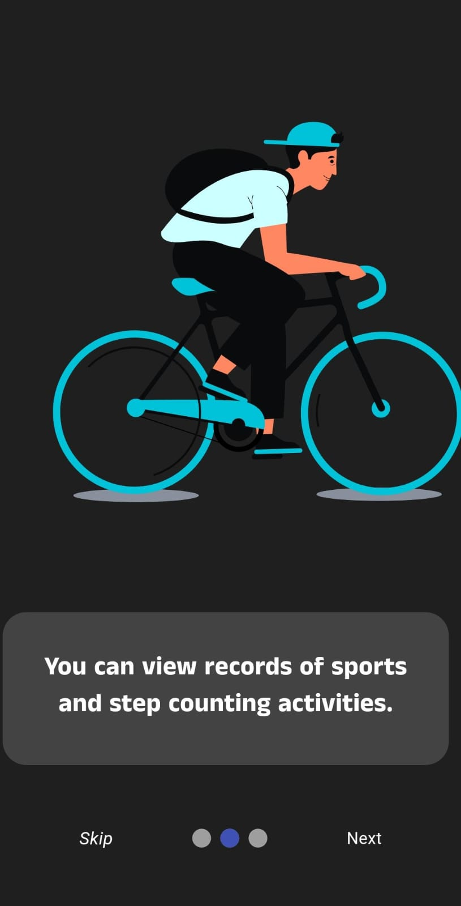
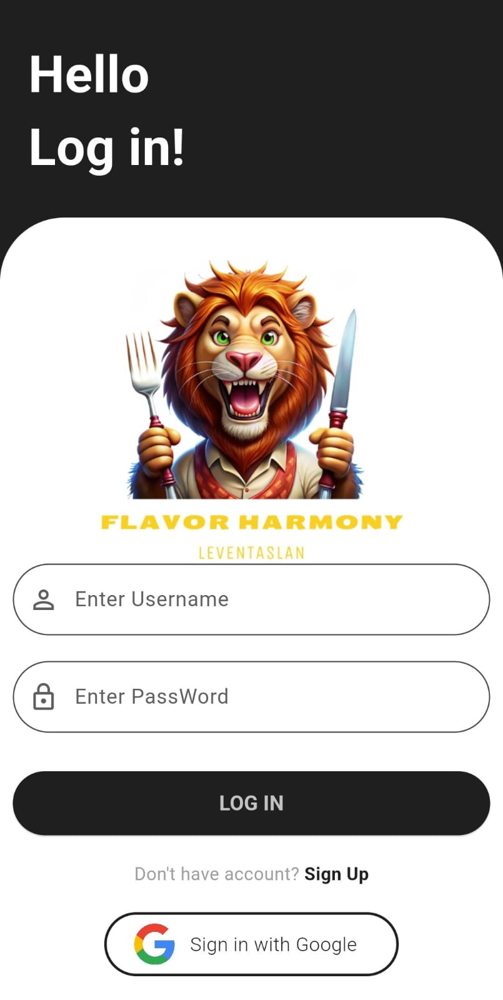
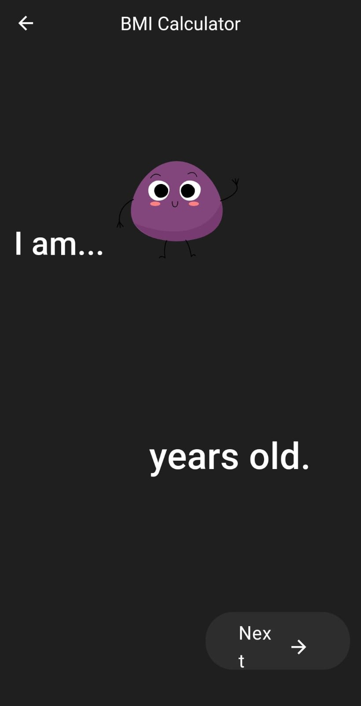
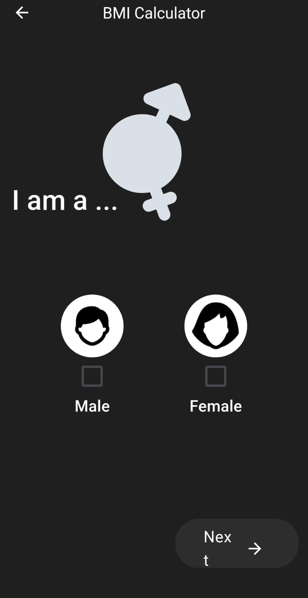
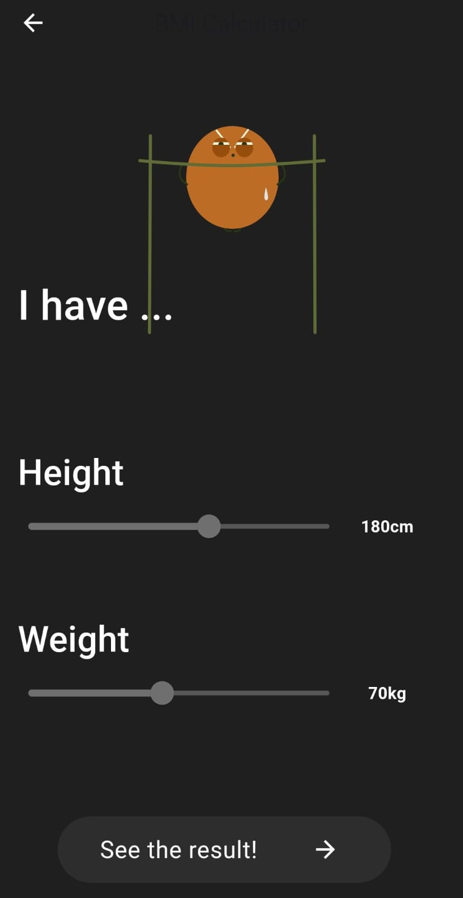
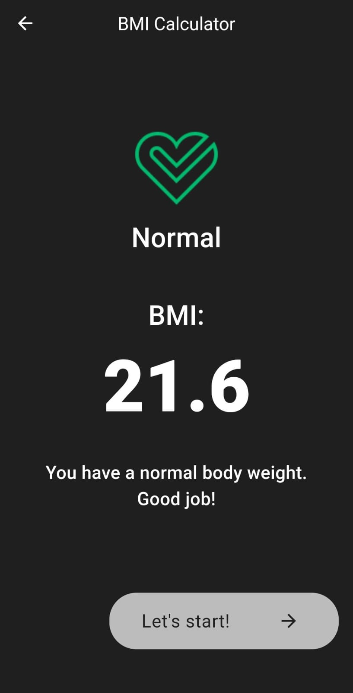
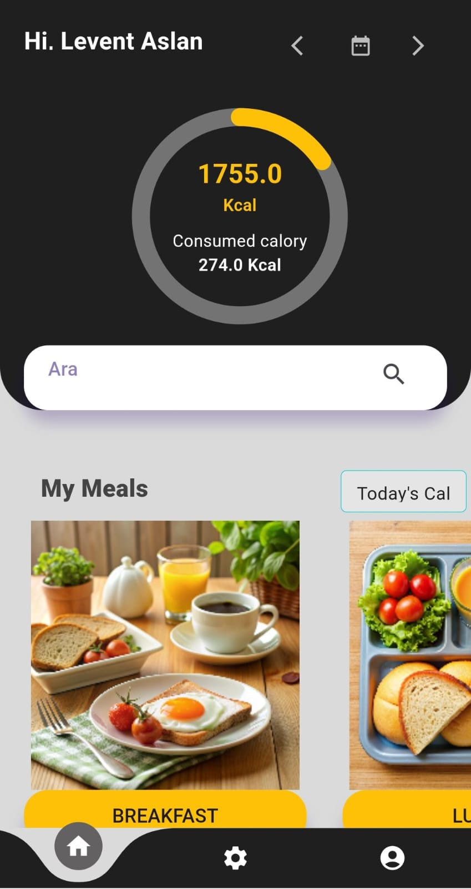
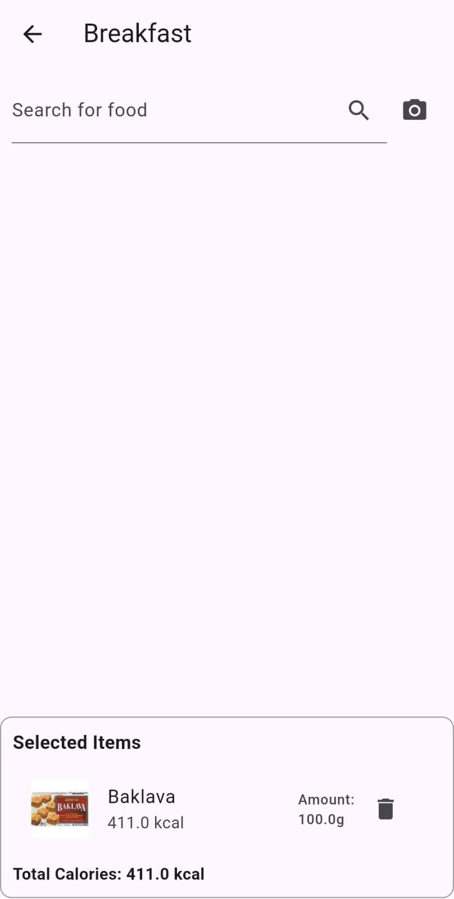
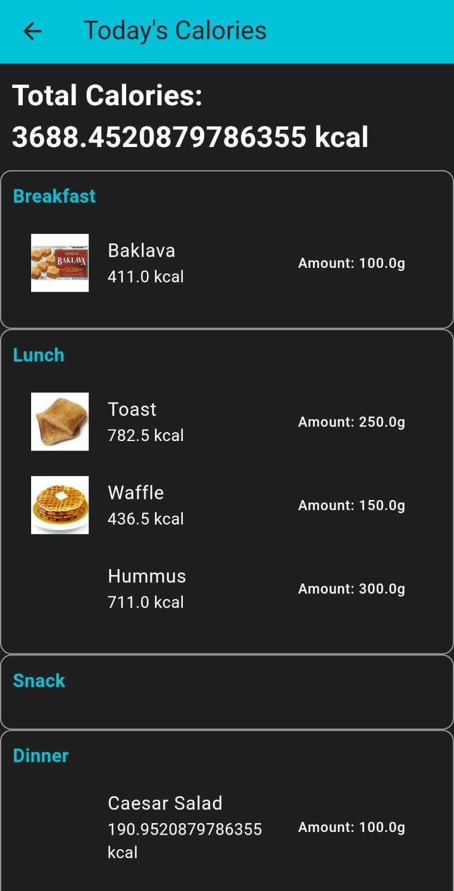
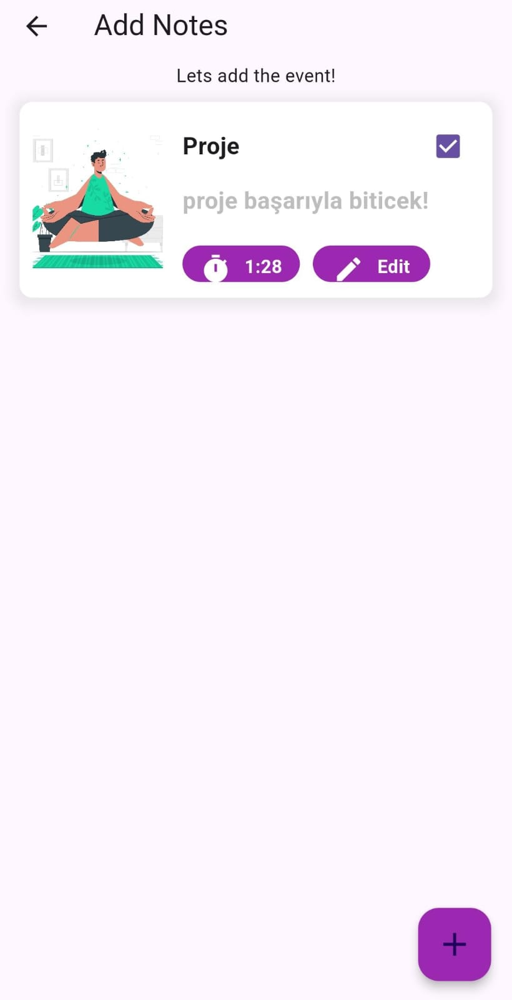

# Flavor Harmony
Flavor Harmony, kişinin nesne tanıma işlemiyle aldığı besinleri öğünlerine ekleyebildiği, aktivitelerini takip edebileceği ve günlük su kullanımını takip edebileceği bir uygulamadır. Bu uygulama, kişinin günlük işlemlerini takip ederken nesne tanıma desteği ile zaman tasarrufu yaparak günlük kullanımı kolaylaştırmayı amaçlamıştır.

### 🛠 Kullanılan Teknolojiler

- Mobil Uygulama Geliştirme: Flutter (https://flutter.dev/)
- Veri Tabanı: Firebase Firestore (https://firebase.google.com/docs/firestore)
- Yapay Zeka Modelleri: Tensorflow, CNN, MobilenNetV2, İnceptionV3, Densenet121, Resnet50, NasnetLarge.

Görseller:

 

  

    <h3 style="color: white; margin-bottom: 10px;">Splash & Tanıtım sayfaları</h3>
    
    
    
    
  

  

    <h3 style="color: white; margin-bottom: 10px;">Giriş, Kayıt & Kullanıcı bilgileri sayfaları</h3>
    
    
    
    
    
    

  

  

    <h3 style="color: white; margin-bottom: 10px;">Anasayfa & Öğün ekleme sayfası & Günlük kalori değerleri & Görev ekleme</h3>
    
    
    
    
  

Flavor Harmony uygulaması, kullanıcıların günlük besin tüketimlerini, spor aktivitelerini ve su tüketimlerini etkili bir şekilde izlemelerine olanak tanır. Uygulamanın nesne tanıma özelliği sayesinde kullanıcılar, yiyeceklerini hızlı ve doğru bir şekilde kaydedebilirler. Bu, kullanıcıların zaman tasarrufu yapmalarını sağlar ve günlük rutinlerini daha etkin bir şekilde yönetmelerine yardımcı olur. Manuel veri girişi seçeneği de sunarak, kullanıcılara esnek bir kullanım deneyimi sağlar.

Uygulama, kullanıcıların aktivitelerini ve günlük adım sayılarını takip etmelerine olanak tanır, bu da kullanıcıların fiziksel aktivitelerini düzenlemelerine ve sağlık hedeflerine ulaşmalarına yardımcı olur. Günlük su tüketimini izleme özelliği, kullanıcıların su tüketim alışkanlıklarını iyileştirmelerine katkıda bulunur, bu da genel sağlık ve zindeliklerini olumlu yönde etkiler.

Uygulama için geriye kalan zamanda gerekli tasarım güncellemeleri, bug düzeltmeleri ve model eğitiminin doğruluğunun daha iyi sonuç vermesi için gerekli iyileştirmeler yapılacaktır. Ayrıca uygulama içine eklenen adım sayma işlemi kısmı daha göze hitab eden bir hale getirilecektir. Bu güncellemeler, kullanıcı deneyimini iyileştirecek ve genel uygulama performansını artıracaktır.

Gelecekte uygulamaya eklenebilecek özellikler arasında, modelin sadece tek bir görüntüyü tanıma işlemi değil, birden çok görüntüyü tanıma yeteneği de bulunabilir. Uygulama içinde Google ile giriş işlemi yapılabilirken, ekstra olarak farklı platformlarda da kullanılabilir. Ayrıca, yiyecek arama işlemini sesli komutlarla kontrol etmek için uygulamaya gerekli güncellemeler getirilebilir.
